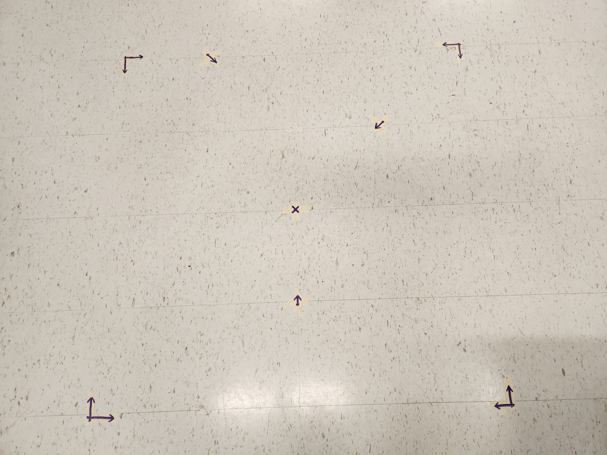
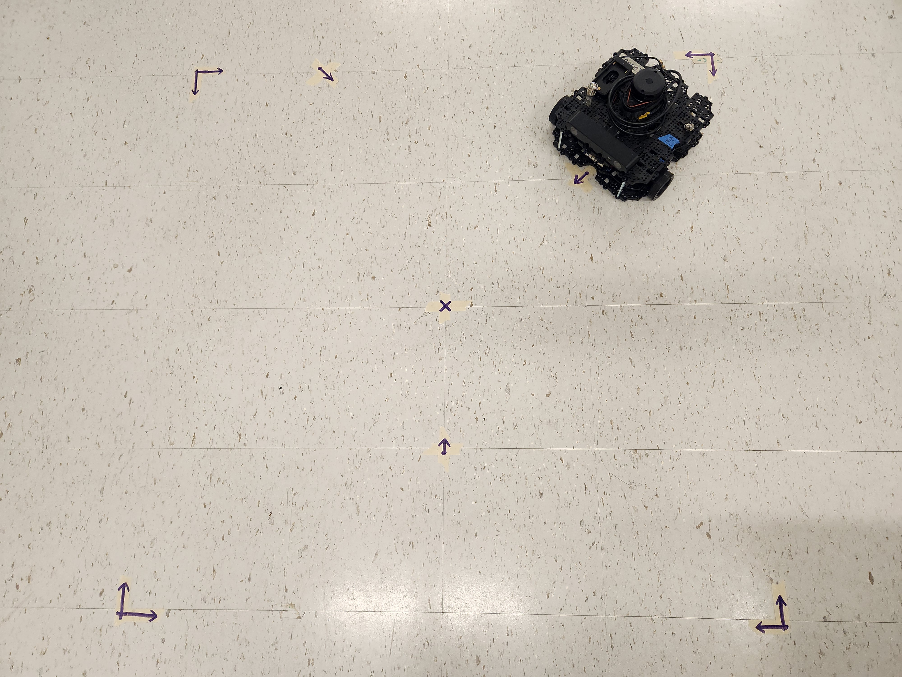
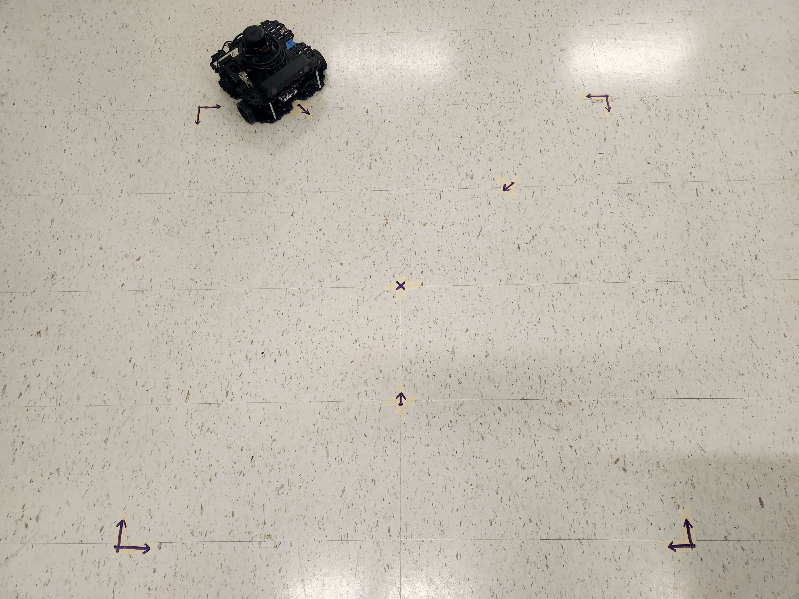
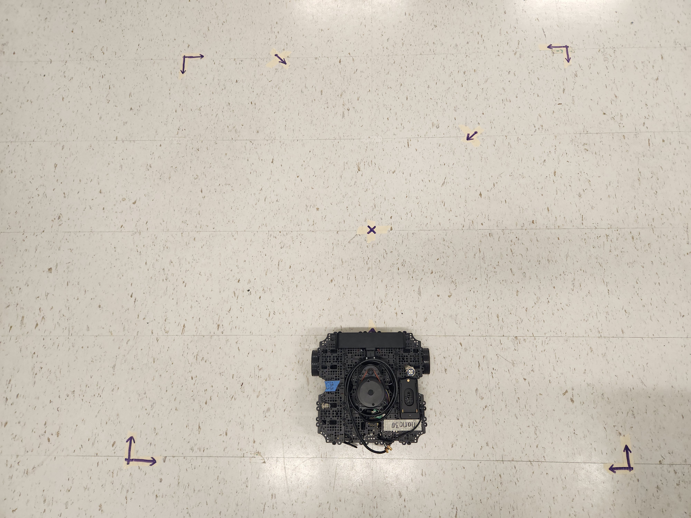
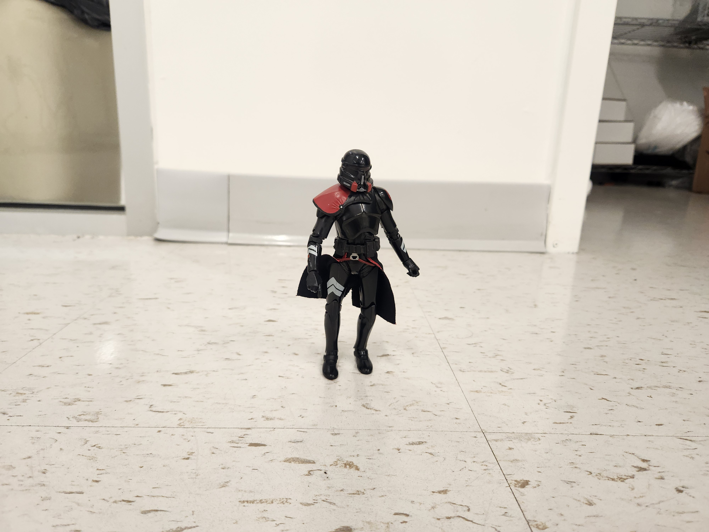
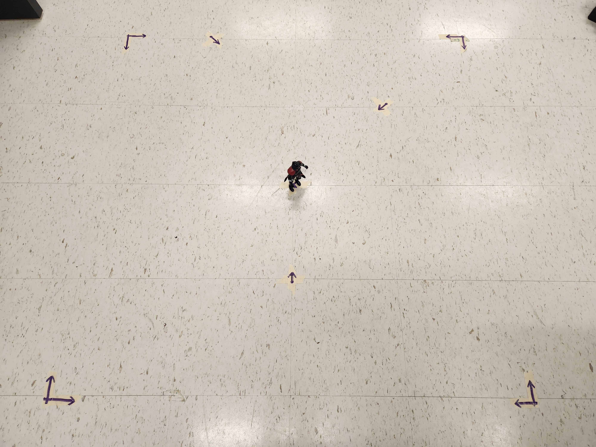

## 1. Set up field of operation.
The field is a 4 x 4 group of the room tiles (standard laminate). The bounding boxes of the tiles should be marked with tape at the corners. The center should be marked with tape, as well as the three positions for the turtlebot data collection. The camera of the turtlebot should meet the edge of their selected location. All locations should be clearly marked and documented with picture. See reference 1.


*reference 1*

Additionally, a photograph of the placement of turtlebots and human figures should be photographed. See reference 2.






*reference 2*

## 2. Set up environments and devices.
Using the control computer, enter a directory where the environment will be placed. Create a new environment using venv or other method. Enter the environment. Install the requirements file in the environment. Similar steps are outlined in step 2 of the README.md.

*In venv environment, edit 'pyvenv.cfg'. Change the 'include-system-site-packages' parameter to equal 'true'. Save.*

```bash
cd ~/Environments

python3 -m venv collection_env

cd collection_env    #if using venv
nano pyvenv.cfg    #if using venv
include-system-site-packages = true    #if using venv

source collection_env/bin/activate

cd ~/Documents/objDetection-refactor

pip install -r requirements_client.txt
```

Using the client collection device (turtlebot or testbed), ensure that you are on the same network by pinging. If not on the network, join the network. Then, ssh into the client and follow similar steps to environment creation above. Install pyzed according to step 4 of step 3 in README.md.

```bash
ping 192.168.0.45

ssh jetson@192.168.0.45

<repeat environment steps above>
<install pyzed according to README.md>
```

## 3. Run the experiment

Maintain the desired position of the human figures throughout the experiement. Place them in the perimitered location defined in reference 1. 

Place the client computer in the first position from reference 2.

Run the data_collection_server.py program on the control computer and the data_collection_client.py program on the client computer.

Go through the prompts of each program.

Repeat for each of the client computer positions.

## 4. Collect the data

The data should have populated in the location mentioned in the data_collection_server.py program. Navigate to the directory to ensure the data populated.

Back in the programming directory, run the network_relation.py program. Ensure the experiement directory is correctly input.

Network relation will generate a matrix for the experiment.